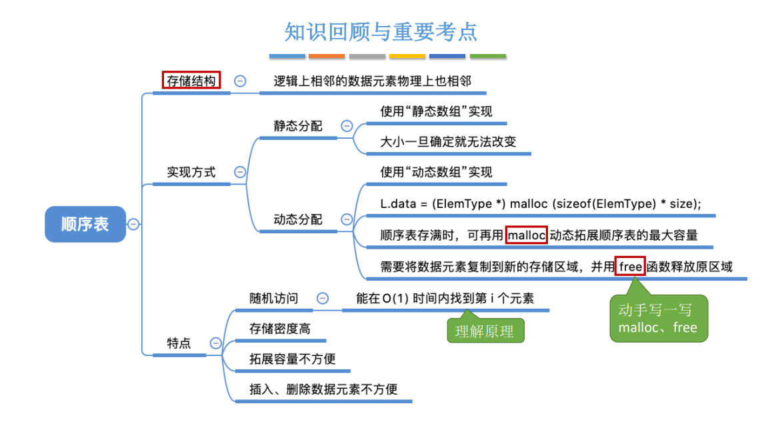

# 一、绪论


## 数据结构的基本概念


### 数据元素

数据元素用于描述一个个体。

==数据元素==是数据的==基本单位==，通常作为一个==整体==进行考虑和处理。

一个数据元素可由若干个==数据项==构成，数据项是构成数据元素的不可分割的==最小单位==。


### 数据对象

==数据对象==是具有==相同性质==的数据元素的集合。是数据的一个子集。

==数据结构==是相互之间存在一种或多种特定==关系==的数据元素的集合。


## 数据结构的三要素

### 逻辑结构

- ~~集合结构~~

- 线性结构    一对一
- 树形结构    一对多
- 图状结构    多对多 


### 数据的运算

针对于某种逻辑结构，结合实际需求，定义==基本运算==


### 物理结构（存储结构）

- 顺序存储

  

- 链式存储

  

  

- 索引存储

  

- 散列存储

  


1.  若采用==顺序存储==，则各个数据元素在物理上必须是==连续的==；若采用==非顺序存储==，则各个数据元素在物理上可以是==离散的==。 
2.  数据的==存储结构==会==影响存储空间分配的方便程度==
3.  数据的==存储结构==会==影响对数据运算的==


## 算法


### 什么是算法

算法（Algorithm）是对==特定问题求解步骤的一种描述==，它是指令的有限序列，其中的每条指令表示一个或多个操作


### 算法的特性

- ==有穷性==

  一个算法必须总在执行有穷步之后结束，且每一步都可在有穷时间内完成

  注：==算法==必须是==有穷==的，而==程序==可以是==无穷==的 

- ==确定性==

  算法中每条指令必须有确切的含义，对于==相同的输入==只能得出==相同的输出==

- ==可行性==。

  算法中描述的操作都可以通过已经实现的==基本运算执行有限次==来实现。

- ==输入==

  一个算法有==零个或多个输入==，这些输入取自于某个特定的对象的集合。 

- ==输出==

  一个算法有==一个或多个输出==，这些输出是与输入有着某种特定关系的量。


### “好算法的特质”

- 正确性

  算法应能够正确地解决求解问题。

- 可读性

  算法应具有良好的可读性，以帮助人们理解。

- 健壮性

  输入非法数据时，算法能适当地做出反应或进行处理，而不会产生莫名其妙的输出结果。

- ==高效率==与==低存储量需求==

  花的时间少。 时间复杂度低

  花的时间少。 时间复杂度低


## 时间复杂度


==最坏时间复杂度：==最坏情况下算法的时间复杂度 

==平均时间复杂度：==所有输入示例等概率出现的情况下，算法的期望运行时间 

最好时间复杂度：最好情况下算法的时间复杂度


## 空间复杂度


算法==原地工作==——算法所需内存空间为==常量==q


# 二、线性表

## 定义、 基本操作


线性表是具有==相同==（<font color ='red'>每个数据元素所 占空间一样大</font>）数据类型的n（n≥0）个==数据元素==的==有限序列==，其中n为表长，当n = 0时线 性表是一个==空表==。若用L命名线性表，则其一般表示为

​							L = (a1, a2, … , ai , ai+1, … , an)

ai是线性表中的“第i个”元素线性表中的==位序== 

a1是==表头元素==；an是==表尾元素==。

 除第一个元素外，每个元素有且仅有一个==直接前驱==；除最后一个元素外，每个元素有且仅有一个==直接后继==

**基本操作**

- InitList(&L)：==初始化==表。构造一个空的线性表L，==分配内存空间==。 

- DestroyList(&L)：==销毁==操作。销毁线性表，并==释放==线性表L所占用的==内存空间==。

- ListInsert(&L,i,e)：==插入==操作。在表L中的第i个位置上插入指定元素e。 

- ListDelete(&L,i,&e)：==删除==操作。删除表L中第i个位置的元素，并用e返回删除元素的值。 

- LocateElem(L,e)：==按值查找==操作。在表L中查找具有给定关键字值的元素。 

- GetElem(L,i)：==按位查找==操作。获取表L中第i个位置的元素的值。 

**其他常用操作：** 

- Length(L)：求表长。返回线性表L的长度，即L中数据元素的个数。

- PrintList(L)：输出操作。按前后顺序输出线性表L的所有元素值。 

- Empty(L)：判空操作。若L为空表，则返回true，否则返回false。 从无到有 从有到无 

Tips： 

​	①对数据的操作（记忆思路） —— 创销、增删改查 

​	②C语言函数的定义 —— <返回值类型> 函数名 (<参数1类型> 参数1，<参数2类型> 参数2，……)

​	③实际开发中，可根据实际需求定义其他的基本操作

​	④函数名和参数的形式、命名都可改变（Reference：严蔚敏版《数据结构》） 

​	⑤[什么时候要传入引用==“&”== —— 对参数的修改结果需要==“带回来”==](./code/LinearList/addressCharacter/addressCharacter.sln)


## 顺序表



### 定义

- 顺序表：

​		用==顺序存储==的方式实现线性表

​		顺序存储：

- 把==逻辑上相邻==的元素存储在==物理位置上也相邻==的存储单元中，元素之间的关系由存储单元的邻接关系来体现

- 顺序表的特点： 

  1. ==随机访问==，即可以在 O(1) 时间内找到第 i 个元素。 

  2. 存储密度高，每个节点只存储数据元素 

  3. 拓展容量不方便（即便采用动态分配的方式实现，拓展长度的时间复杂度也比较高） 

  4. 插入、删除操作不方便，需要移动大量元素

- 代码实现：

​		[静态分配](./code/LinearList/S-SqList/S-SqList.sln)

​		[动态分配](./code/LinearList/D-SqList/D-SqList.sln)


### 插入

```c++
bool insertList(SqList &L ,int i,int e) {
	// 判断i的范围是否有效
	if (i<1||i>L.length+1) {
		return false;
	}
	// 线性表已满，无法插入
	if (L.length >= maxSize) {
		return false;
	}
	
	// 将第i个元素之后的元素后移
	for (int j = L.length; j >= i; j--) {
		L.data[j] = L.data[j - 1];
	}
	
	//插入
	L.data[i-1] = e;

	//长度加一
	L.length++;
	return true;
}
```

==最好情况==：新元素插入到表尾，不需要移动元素 i = n+1，循环0次；最好时间复杂度 = ==O(1)==

==最坏情况==：新元素插入到表头，需要将原有的 n 个元素全都向后移动 i = 1，循环 n 次；最坏时间复杂度 = ==O(n)==; 平均情况：假设新元素插入到任何一个位置的概率相同，即 i = 1,2,3, … , length+1 的概率都是 
$$
p=\frac { 1 } { n + 1 }
$$
，循环 n 次；i=2 时，循环 n-1 次；i=3，循环 n-2 次 …… i =n+1时，循环0次 问题规模 n = L.length （表长） 平均循环次数
$$
n p + ( n - 1 ) p + ( n - 2 ) p + \cdots \cdots + 1 \cdot p = \frac { n ( n + 1 ) } { 2 } \frac { 1 } { n + 1 } = \frac { n } { 2 }
$$
==平均时间复杂度 = O(n)==

​	

### 删除

```c++
bool deleteList(SqList& L, int i, int &e) {
	// 判断i的范围是否有效
	if (i<1 || i>L.length + 1) {
		return false;
	}

	// 返回删除元素至e中
	e = L.data[i - 1];

	// 将第i个元素位置后的元素前移
	for (int j = i; j <= L.length; j++) {
		L.data[j-1] = L.data[j];
	}
	
	//长度减一
	L.length--;
	return true;
}
```

==最好情况==：删除表尾元素，不需要移动其他元素 i = n，循环 0 次；最好时间复杂度 = ==O(1)== 

==最坏情况==：删除表头元素，需要将后续的 n-1 个元素全都向前移动 i = 1，循环 n-1 次；最坏时间复杂度 = ==O(n)==; 

平均情况：假设删除任何一个元素的概率相同，即 i = 1,2,3, … , length 的概率都是 
$$
p=\frac { 1 } { n + 1 }
$$
，循环 n-1 次；i=2 时，循环 n-2 次；i=3，循环 n-3 次 …… i =n 时，循环0次 问题规模 n = L.length （表长） 平均循环次数
$$
n p + ( n - 1 ) p + ( n - 2 ) p + \cdots \cdots + 1 \cdot p = \frac { n ( n + 1 ) } { 2 } \frac { 1 } { n + 1 } = \frac { n } { 2 }
$$
==平均时间复杂度 = O(n)==


### 查找

```c++
/*
按位查找,时间复杂度O(1)
*/
int get(SqList L, int i) {
	return L.data[i - 1];
}


/*
按置查找,时间复杂度O(n)
*/
int locate(SqList L, int e) {
	for (int i = 0; i < L.length; i++) {
		if (L.data[i] == e) {
			return i+1;
			break;
		}
	}
	return 0;
}
```

==注意==：C语言中，==结构体的比较不能直接用 “== ”==


## 链表

### 单链表

#### 定义


```c++
typedef struct LNode {
	int data;
	int* next;
}LNode,*LinkList;

//LNode 强调的是节点
//LinkList 强调的是链表  
```


- 代码实现：

​		[带头指针](./code/LinearList/LinkListWithHead/LinkListWithHead.sln)

​		[不带头指针](./code/LinearList/LinkListWithoutHead/LinkListWithoutHead.sln)


#### 插入

- 按位序插入（带头结点）

  平均时间复杂度：==O(n)==

  ```c++
  /*
  在第i个位置插入e O(n)
  */
  bool insert(LinkList &L, int i, int e) {
  	//判断i的合法性
  	if (i < 1) {
  		return false;
  	}
  	//使用p指向L的头节点
  	LNode* p=L;
  	//用j代表第几个节点
  	int j = 0;
  	//找到第i-1个节点
  	while (p != NULL && j < i-1) {
  		p = p->next;
  		j++;
  	}
      
  	//如果超出链表尾部
  	if (p == NULL) {
  		return false;
  	}
      
  	//申请节点内存
  	LNode* s = (LNode *)malloc(sizeof(LNode));
  
  	//插入节点
  	s->data = e;
  	s->next = p->next;
  	p->next = s;
  	return true;
  
  }
  ```

- 按位序插入（不带头结点）

  平均时间复杂度：==O(n)==

  ```c++
  /*
  在第i个位置插入e
  */
  bool insert(LinkList& L, int i, int e) {
  	//判断i的合法性
  	if (i < 1) {
  		return false;
  	}
  	//判断i=1是的情况
  	if (i == 1) {
  		LNode* s = (LNode*)malloc(sizeof(LNode));
  		s->data = e;
  		s->next = L;
  		L = s;
  		return true;
  	}
  	//使用p指向L的头节点
  	LNode* p = L;
  	//用j代表第几个节点
  	int j = 1;
  	//找到第i个节点
  	while (p != NULL && j < i - 1) {
  		p = p->next;
  		j++;
  	}
  	//如果超出链表尾部
  	if (p == NULL) {
  		return false;
  	}
  
  	//申请节点内存
  	LNode* s = (LNode*)malloc(sizeof(LNode));
  
  	//插入节点
  	s->data = e;
  	s->next = p->next;
  	p->next = s;
  	return true;
  }
  ```

  

#### 删除

- 按位序删除（带头结点）

  平均时间复杂度：==O(n)==

  ```c++
  /*
  删除第i个位置并返回e,O(n)
  */
  bool deleteList(LinkList& L, int i, int& e) {
  	if (i < 1) {
  		return false;
  	}
  	LNode* p = L;
  	//用j代表第几个节点
  	int j = 0;
  	//找到第i-1个节点
  	while (p != NULL && j < i - 1) {
  		p = p->next;
  		j++;
  	}
  	//如果超出链表尾部
  	if (p == NULL || p->next==NULL) {
  		return false;
  	}
  	LNode* q = p->next;
  	e = q->data;
  	p->next = q->next;
  	free(q);
  	return true;
  }
  ```

- 删除指定节点并返回e

  平均时间复杂度：==O(1)==

  ```c++
  /*
  删除指定节点并返回e, O(1)
  */
  bool deleteNode(LNode *p, int& e) {
  	if (p == NULL) {
  		return false;
  	}
  	LNode* q = p->next;
  	p->data = q->data;
  	p->next = q->next;
  	free(q);
  	return true;
  }
  ```


#### 查找

- 按位查找

  ```c++
  /*
  按位查找
  */
  LNode* getElem(LinkList L, int i) {
  	if (i < 0) {
  		return NULL;
  	}
  	LNode* p;
  	int j = 0;
  	p = L;
  	while (p != NULL && j < i)
  	{
  		p = p->next;
  		j++;
  		
  	}
  	return p;
  }
  ```

- 按值查找

  ```c++
  /*
  按值查找
  */
  LNode* locatelElem(LinkList L, int e) {
  	LNode* p = L->next;
  	while (p->data != e&&p!=NULL) {
  		p = p->next;
  	}
  	return p;
  }
  ```

- 求表的长度

  ```C++
  int Length(LinkList L) {
  	int len = 0; //统计表长
  	LNode * p = L;
  	while (p->next !=NULL){
  		p = p->next;
  		len++;
  	}
  	return len;
  }
  ```

  


