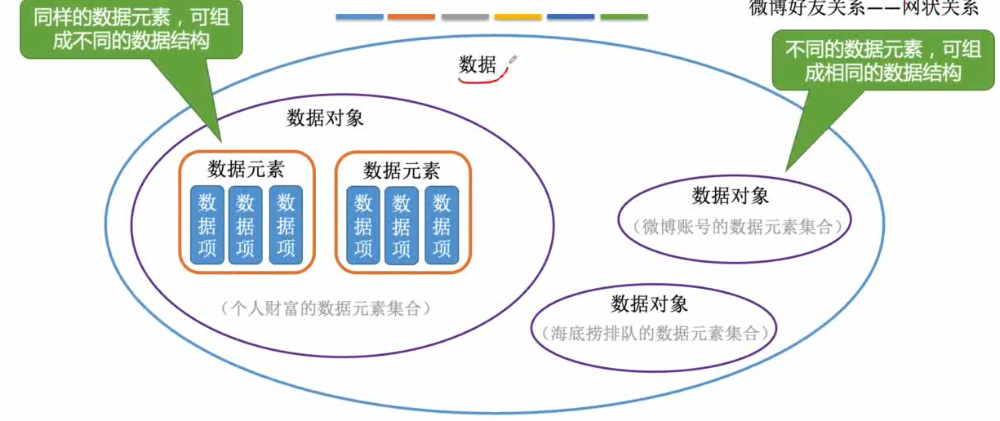

# 一、绪论


## 数据结构的基本概念


### 数据元素

数据元素用于描述一个个体。

==数据元素==是数据的==基本单位==，通常作为一个==整体==进行考虑和处理。

一个数据元素可由若干个==数据项==构成，数据项是构成数据元素的不可分割的==最小单位==。


### 数据对象

==数据对象==是具有==相同性质==的数据元素的集合。是数据的一个子集。

==数据结构==是相互之间存在一种或多种特定==关系==的数据元素的集合。



## 数据结构的三要素

### 逻辑结构

- ~~集合结构~~

- 线性结构    一对一
- 树形结构    一对多
- 图状结构    多对多 


### 数据的运算

针对于某种逻辑结构，结合实际需求，定义==基本运算==


### 物理结构（存储结构）

- 顺序存储

  

- 链式存储

  

  

- 索引存储

  

- 散列存储

  


1.  若采用==顺序存储==，则各个数据元素在物理上必须是==连续的==；若采用==非顺序存储==，则各个数据元素在物理上可以是==离散的==。 
2.  数据的==存储结构==会==影响存储空间分配的方便程度==
3.  数据的==存储结构==会==影响对数据运算的==


## 算法


### 什么是算法

算法（Algorithm）是对==特定问题求解步骤的一种描述==，它是指令的有限序列，其中的每条指令表示一个或多个操作


### 算法的特性

- ==有穷性==

  一个算法必须总在执行有穷步之后结束，且每一步都可在有穷时间内完成

  注：==算法==必须是==有穷==的，而==程序==可以是==无穷==的 

- ==确定性==

  算法中每条指令必须有确切的含义，对于==相同的输入==只能得出==相同的输出==

- ==可行性==。

  算法中描述的操作都可以通过已经实现的==基本运算执行有限次==来实现。

- ==输入==

  一个算法有==零个或多个输入==，这些输入取自于某个特定的对象的集合。 

- ==输出==

  一个算法有==一个或多个输出==，这些输出是与输入有着某种特定关系的量。


### “好算法的特质”

- 正确性

  算法应能够正确地解决求解问题。

- 可读性

  算法应具有良好的可读性，以帮助人们理解。

- 健壮性

  输入非法数据时，算法能适当地做出反应或进行处理，而不会产生莫名其妙的输出结果。

- ==高效率==与==低存储量需求==

  花的时间少。 时间复杂度低

  花的时间少。 时间复杂度低


## 时间复杂度


==最坏时间复杂度：==最坏情况下算法的时间复杂度 

==平均时间复杂度：==所有输入示例等概率出现的情况下，算法的期望运行时间 

最好时间复杂度：最好情况下算法的时间复杂度


## 空间复杂度


算法==原地工作==——算法所需内存空间为==常量==q


# 二、线性表

## 定义、 基本操作


线性表是具有==相同==（<font color ='red'>每个数据元素所 占空间一样大</font>）数据类型的n（n≥0）个==数据元素==的==有限序列==，其中n为表长，当n = 0时线 性表是一个==空表==。若用L命名线性表，则其一般表示为

​							L = (a1, a2, … , ai , ai+1, … , an)

ai是线性表中的“第i个”元素线性表中的==位序== 

a1是==表头元素==；an是==表尾元素==。

 除第一个元素外，每个元素有且仅有一个==直接前驱==；除最后一个元素外，每个元素有且仅有一个==直接后继==

**基本操作**

- InitList(&L)：==初始化==表。构造一个空的线性表L，==分配内存空间==。 

- DestroyList(&L)：==销毁==操作。销毁线性表，并==释放==线性表L所占用的==内存空间==。

- ListInsert(&L,i,e)：==插入==操作。在表L中的第i个位置上插入指定元素e。 

- ListDelete(&L,i,&e)：==删除==操作。删除表L中第i个位置的元素，并用e返回删除元素的值。 

- LocateElem(L,e)：==按值查找==操作。在表L中查找具有给定关键字值的元素。 

- GetElem(L,i)：==按位查找==操作。获取表L中第i个位置的元素的值。 

**其他常用操作：** 

- Length(L)：求表长。返回线性表L的长度，即L中数据元素的个数。

- PrintList(L)：输出操作。按前后顺序输出线性表L的所有元素值。 

- Empty(L)：判空操作。若L为空表，则返回true，否则返回false。 从无到有 从有到无 

Tips： 

​	①对数据的操作（记忆思路） —— 创销、增删改查 

​	②C语言函数的定义 —— <返回值类型> 函数名 (<参数1类型> 参数1，<参数2类型> 参数2，……)

​	③实际开发中，可根据实际需求定义其他的基本操作

​	④函数名和参数的形式、命名都可改变（Reference：严蔚敏版《数据结构》） 

​	⑤[什么时候要传入引用==“&”== —— 对参数的修改结果需要==“带回来”==](./code/LinearList/addressCharacter/main.cpp)


## 顺序表


### 定义

- 顺序表：

​		用==顺序存储==的方式实现线性表

​		顺序存储：

- 把==逻辑上相邻==的元素存储在==物理位置上也相邻==的存储单元中，元素之间的关系由存储单元的邻接关系来体现

- 顺序表的特点： 

  1. ==随机访问==，即可以在 O(1) 时间内找到第 i 个元素。 

  2. 存储密度高，每个节点只存储数据元素 

  3. 拓展容量不方便（即便采用动态分配的方式实现，拓展长度的时间复杂度也比较高） 

  4. 插入、删除操作不方便，需要移动大量元素

- 代码实现：

​		[静态分配](./code/LinearList/SSqList/main.cpp)

​		[动态分配](./code/LinearList/DSqList/main.cpp)


### 插入

```c++
bool insertList(SqList &L ,int i,int e) {
	// 判断i的范围是否有效
	if (i<1||i>L.length+1) {
		return false;
	}
	// 线性表已满，无法插入
	if (L.length >= maxSize) {
		return false;
	}
	
	// 将第i个元素之后的元素后移
	for (int j = L.length; j >= i; j--) {
		L.data[j] = L.data[j - 1];
	}
	
	//插入
	L.data[i-1] = e;

	//长度加一
	L.length++;
	return true;
}
```

==最好情况==：新元素插入到表尾，不需要移动元素 i = n+1，循环0次；最好时间复杂度 = ==O(1)==

==最坏情况==：新元素插入到表头，需要将原有的 n 个元素全都向后移动 i = 1，循环 n 次；最坏时间复杂度 = ==O(n)==; 平均情况：假设新元素插入到任何一个位置的概率相同，即 i = 1,2,3, … , length+1 的概率都是 
$$
p=\frac { 1 } { n + 1 }
$$
，循环 n 次；i=2 时，循环 n-1 次；i=3，循环 n-2 次 …… i =n+1时，循环0次 问题规模 n = L.length （表长） 平均循环次数
$$
n p + ( n - 1 ) p + ( n - 2 ) p + \cdots \cdots + 1 \cdot p = \frac { n ( n + 1 ) } { 2 } \frac { 1 } { n + 1 } = \frac { n } { 2 }
$$
==平均时间复杂度 = O(n)==

​	

### 删除

```c++
bool deleteList(SqList& L, int i, int &e) {
	// 判断i的范围是否有效
	if (i<1 || i>L.length + 1) {
		return false;
	}

	// 返回删除元素至e中
	e = L.data[i - 1];

	// 将第i个元素位置后的元素前移
	for (int j = i; j <= L.length; j++) {
		L.data[j-1] = L.data[j];
	}
	
	//长度减一
	L.length--;
	return true;
}
```

==最好情况==：删除表尾元素，不需要移动其他元素 i = n，循环 0 次；最好时间复杂度 = ==O(1)== 

==最坏情况==：删除表头元素，需要将后续的 n-1 个元素全都向前移动 i = 1，循环 n-1 次；最坏时间复杂度 = ==O(n)==; 

平均情况：假设删除任何一个元素的概率相同，即 i = 1,2,3, … , length 的概率都是 
$$
p=\frac { 1 } { n + 1 }
$$
，循环 n-1 次；i=2 时，循环 n-2 次；i=3，循环 n-3 次 …… i =n 时，循环0次 问题规模 n = L.length （表长） 平均循环次数
$$
n p + ( n - 1 ) p + ( n - 2 ) p + \cdots \cdots + 1 \cdot p = \frac { n ( n + 1 ) } { 2 } \frac { 1 } { n + 1 } = \frac { n } { 2 }
$$
==平均时间复杂度 = O(n)==


### 查找

```c++
/*
按位查找,时间复杂度O(1)
*/
int get(SqList L, int i) {
	return L.data[i - 1];
}


/*
按置查找,时间复杂度O(n)
*/
int locate(SqList L, int e) {
	for (int i = 0; i < L.length; i++) {
		if (L.data[i] == e) {
			return i+1;
			break;
		}
	}
	return 0;
}
```

==注意==：C语言中，==结构体的比较不能直接用 “== ”==


## 链表

### 单链表

#### 定义


```c++
写法一:
typedef struct LNode LNode;
typedef struct LNode *LinkList;
struct LNode{
    int data;
    struct LNode *next;
};
写法二:
typedef struct LNode {
	int data;
	int* next;
}LNode,*LinkList;

//LNode 强调的是节点
//LinkList 强调的是链表  
```


- 代码实现：

​		[带头指针](./code/LinearList/LinkListWithHead/main.cpp)

​		[不带头指针](./code/LinearList/LinkListWithoutHead/main.cpp)


#### 插入

- 按位序插入（带头结点）

  平均时间复杂度：==O(n)==

  ```c++
  /*
  在第i个位置插入e O(n)
  */
  bool insert(LinkList &L, int i, int e) {
  	//判断i的合法性
  	if (i < 1) {
  		return false;
  	}
  	//使用p指向L的头节点
  	LNode* p=L;
  	//用j代表第几个节点
  	int j = 0;
  	//找到第i-1个节点
  	while (p != NULL && j < i-1) {
  		p = p->next;
  		j++;
  	}
      
  	//如果超出链表尾部
  	if (p == NULL) {
  		return false;
  	}
      
  	//申请节点内存
  	LNode* s = (LNode *)malloc(sizeof(LNode));
  
  	//插入节点
  	s->data = e;
  	s->next = p->next;
  	p->next = s;
  	return true;
  
  }
  ```

- 按位序插入（不带头结点）

  平均时间复杂度：==O(n)==

  ```c++
  /*
  在第i个位置插入e
  */
  bool insert(LinkList& L, int i, int e) {
  	//判断i的合法性
  	if (i < 1) {
  		return false;
  	}
  	//判断i=1是的情况
  	if (i == 1) {
  		LNode* s = (LNode*)malloc(sizeof(LNode));
  		s->data = e;
  		s->next = L;
  		L = s;
  		return true;
  	}
  	//使用p指向L的头节点
  	LNode* p = L;
  	//用j代表第几个节点
  	int j = 1;
  	//找到第i个节点
  	while (p != NULL && j < i - 1) {
  		p = p->next;
  		j++;
  	}
  	//如果超出链表尾部
  	if (p == NULL) {
  		return false;
  	}
  
  	//申请节点内存
  	LNode* s = (LNode*)malloc(sizeof(LNode));
  
  	//插入节点
  	s->data = e;
  	s->next = p->next;
  	p->next = s;
  	return true;
  }
  ```

  

#### 删除

- 按位序删除（带头结点）

  平均时间复杂度：==O(n)==

  ```c++
  /*
  删除第i个位置并返回e,O(n)
  */
  bool deleteList(LinkList& L, int i, int& e) {
  	if (i < 1) {
  		return false;
  	}
  	LNode* p = L;
  	//用j代表第几个节点
  	int j = 0;
  	//找到第i-1个节点
  	while (p != NULL && j < i - 1) {
  		p = p->next;
  		j++;
  	}
  	//如果超出链表尾部
  	if (p == NULL || p->next==NULL) {
  		return false;
  	}
  	LNode* q = p->next;
  	e = q->data;
  	p->next = q->next;
  	free(q);
  	return true;
  }
  ```

- 删除指定节点并返回e

  平均时间复杂度：==O(1)==

  ```c++
  /*
  删除指定节点并返回e, O(1)
  */
  bool deleteNode(LNode *p, int& e) {
  	if (p == NULL) {
  		return false;
  	}
  	LNode* q = p->next;
  	p->data = q->data;
  	p->next = q->next;
  	free(q);
  	return true;
  }
  ```


#### 查找

- 按位查找

  ```c++
  /*
  按位查找
  */
  LNode* getElem(LinkList L, int i) {
  	if (i < 0) {
  		return NULL;
  	}
  	LNode* p;
  	int j = 0;
  	p = L;
  	while (p != NULL && j < i)
  	{
  		p = p->next;
  		j++;
  		
  	}
  	return p;
  }
  ```

- 按值查找

  ```c++
  /*
  按值查找
  */
  LNode* locatelElem(LinkList L, int e) {
  	LNode* p = L->next;
  	while (p->data != e&&p!=NULL) {
  		p = p->next;
  	}
  	return p;
  }
  ```

- 求表的长度

  ```C++
  int Length(LinkList L) {
  	int len = 0; //统计表长
  	LNode * p = L;
  	while (p->next !=NULL){
  		p = p->next;
  		len++;
  	}
  	return len;
  }
  ```

  

#### 头插法

- 不带头节点

  ```c++
  /*
  头插法，O(n)
  */
  LinkList listHeadInsert(LinkList& L) {
  	//初始化链表
  	//initLinkList(L);
  	//p指针指向头节点
  	LNode* p = L;
  	//输入值x
  	int x;
  	scanf_s("%d", &x);
  	//x=-1时停止输入
  	while (x != -1) {
  		//新建结点
  		LNode* s = (LNode*)malloc(sizeof(LNode));
  		//设置新建结点的值为x
  		s->data = x;
  		//新建结点的next为原来头指针的next
  		s->next = p->next;
  		//头节点的next为新建结点
  		p->next = s;
  		scanf_s("%d", &x);
  	}
  	return L;
  }
  ```

- 不带头节点

  ```c++
  /*
  头插法，O(n)
  */
  LinkList listHeadInsert(LinkList& L) {
  	//初始化链表
  	initLinkList(L);
  
  	//输入值x
  	int x;
  	scanf_s("%d", &x);
  	//x=-1时停止输入
  	while (x != -1) {
  		//新建结点
  		LNode* s = (LNode*)malloc(sizeof(LNode));
  		//设置新建结点的值为x
  		s->data = x;
  		//新建结点的next为L
  		s->next = L;
  		//L指向新建结点
  		L = s;	
  		scanf_s("%d", &x);
  	}
  	return L;
  }
  
  ```

  

#### 尾插法

- 带头节点

  ```c++
  /*
  尾插法，O(n)
  */
  LinkList listTailInsert(LinkList &L) {
  	//初始化链表
  	//initLinkList(L);
  	//尾指针指向头节点
  	LNode * p = L;
  	//输入值x
  	int x;
  	scanf_s("%d", &x);
  	//x=-1时停止输入
  	while (x!=-1){
  		//新建结点
  		LNode* 	s=(LNode*)malloc(sizeof(LNode));
  		//设置新建结点的值为x
  		s->data = x;
  		//尾指针的next为新建结点
  		p->next = s;
  		//尾指针指向新建结点
  		p = s;
  		scanf_s("%d",& x);
  	}
  	//尾指针的next指向NULL
  	p->next = NULL;
  	return L;
  }
  ```

- 不带头结点

  ```c++
  /*
  尾插法，O(n)
  */
  LinkList listTailInsert(LinkList& L) {
  	//初始化链表
  	//initLinkList(L);
  	
  	//尾指针指向L
  	LNode* p = L;
  
  	//输入值x
  	int x;
  	scanf_s("%d", &x);
  	//x=-1时停止输入
  	while (x != -1) {
  		if (p == NULL) {
  			LNode* s = (LNode*)malloc(sizeof(LNode));
  			s->data = x;
  			s->next = NULL;
  			L = s;
  			p = L;
  		}
  		else
  		{
  			//新建结点
  			LNode* s = (LNode*)malloc(sizeof(LNode));
  			s->data = x;
  			p->next = s;
  			p = s;
  		}
  
  		scanf_s("%d", &x);
  	}
  	p->next = NULL;
  	return L;
  }
  ```


#### 逆置链表

- 带头结点

  ```c++
  /*
  使用头插法，逆置链表
  */
  LinkList reserve(LinkList L) {
  	LinkList reserveList;
  	initLinkList(reserveList);
  
  	LNode* r = reserveList;
  	
  	LNode* p = L->next;
  	while (p!= NULL) {
  		LNode* s = (LNode*)malloc(sizeof(LNode));
  		s->data = p->data;
  		s->next = r->next;
  		r->next = s;
  		p = p->next;
  	}
  	return reserveList;
  }
  ```

- 不带头结点

  ```c++
  LinkList reserve(LinkList L) {
  
  	LinkList reserveList;
  	initLinkList(reserveList);
  
  	LNode* p = L;
  	while (p != NULL) {
  		LNode* s = (LNode*)malloc(sizeof(LNode));
  		s->data = p->data;
  		s->next = reserveList;
  		reserveList = s;
  		p = p->next;
  	}
  	return reserveList;
  }
  ```

  


### 双链表

#### 定义

```c++
typedef struct DNode{
	int data;
	DNode* prior, *next;
}DNode,*DLInkList;
```

代码实现：

[双链表](./code/LinearList/DLinkList/main.cpp)


#### 插入（后插）

```c++
/*
在p结点后插入s结点
*/
bool insertNextDNode(DNode* p, DNode* s) {
	//判断p,q的合法性
	if (p == NULL || s == NULL) {
		return false;
	}
	//s结点的next为p的next
	s->next = p->next;
	//判断p是否为最后一个结点，防止p->next->prior空指针错误
	if (p->next != NULL) {
		p->next->prior = s;
	}

	//s结点的prior为p
	s->prior = p;
	//p的next为s
	p->next = s;
	return true;
}
```


#### 删除（后删）

```c++
/*
删除p的后继结点
*/
bool deleteNextDNode(DNode* p) {
	if (p == NULL) {
		return false;
	}
	DNode* q = p->next;
	p->next = q->next;
	if (q->next != NULL) {
		q->next->prior = p;
	}
	free(q);
	return true;
}
```


### 循环链表


### [静态链表](./课件/2/2.3.5_静态链表.pdf)


### [顺序表和链表的比较](./课件/2/2.3.6_顺序表和链表的比较.pdf)


#### 逻辑结构

​	都属于线性表，都是线性结构


#### 存储结构

都属于线性表，都是线性结构

- 顺序表（顺序存储）

​		优点：==支持随机存取、存储密度高==

​		缺点：==大片连续空间分配不方便，改变容量不方便==

- 链表 （链式存储）

  优点：==离散的小空间分配方便，改变容量方便==

  缺点：==不可随机存取，存储密度低==


#### 基本操作

|                | 顺序表 | 链表 |
| :------------: | ------ | ---- |
| 弹性（可扩容） | ✗      | ✓    |
|     增、删     | ✗      | ✓    |
|       查       | ✓      | ✗    |

表长难以预估、经常要增加/删除元素 ——链表 

表长可预估、查询（搜索）操作较多 ——顺序表


==问题： 请描述顺序表和链表的 bla bla bla…==

实现线性表时，用顺序表还是链表好？ 

顺序表和链表的逻辑结构都是==线性结构==，都属于线性表。 

但是二者的==存储结构==不同，顺序表采用顺序存储(特点，带来的优点缺点)；链表采用链式存储…（特 点、导致的优缺点）。 

由于采用不同的存储方式实现，因此==基本操作==的实现效率也不同。当初始化时…；当插入一个数据元 素时…；当删除一个数据元素时…；当查找一个数据元素时...


# 三、栈和队列


## 栈

### 定义


栈（Stack）是只允许在==一端进行插入或删除操作==的线性表

特点：==后进先出== Last In First Out （==LIFO==）

==n个不同元素进栈==，出栈元素==不同排列的个数==为
$$
\frac { 1 } { n + 1 } C _ { 2 n } ^ { n }
$$
 上述公式称为卡特兰（Catalan）数，可采用数学归纳法证 明（不要求掌握）


### 顺序栈 

- 代码实现

  [顺序栈](./code/Stack/SqStack/main.cpp)


#### 定义

```c++
typedef struct {
	int data[maxSize];
	int top;
}SqStcak;
```


#### 进栈

```c++
bool push(SqStcak &S,int e) {	
	//栈满
	if(S.top==maxSize){

		return false;
	}
	//元素入栈,再栈顶指针先加一
	//S.top++;
	S.data[S.top++] = e;
	return true;
}
```


#### 出栈

```c++
bool pop(SqStcak& S, int& e) {
	//栈空
	if (isEmpty(S)) {
		return false;
	}
	//栈顶指针减一,再栈顶元素出栈,
	e = S.data[--S.top];
	return true;
}
```


#### 获取栈顶元素

```c++
bool getTop(SqStcak S, int& e) {
	//栈空
	if (isEmpty(S)) {
		return false;
	}
	//栈顶元素出栈,再栈顶指针减一
	e = S.data[S.top];
	return true;
}
```


### 链栈


- 代码实现

​		[链栈](./code/Stack/LinkStack/main.cpp)

#### 定义

```c++
typedef struct LNode {
	int data;
 	LNode* next;
} * LinkStack;
```


#### 带头结点

```c++
/*
带头结点
*/
bool initLinkStack(LinkStack& S) {
	S = (LNode*)malloc(sizeof(LNode));
	if (S == NULL) {
		return false;
	}
	S->next = NULL;
	return true;
}

bool isEmpty(LinkStack S) {
	return S->next == NULL;
}

bool push(LinkStack& S,int e) {
	LNode* p = (LNode*)malloc(sizeof(LNode));
	if (p == NULL) {
		return false;
	}
	p->next = S->next;
	p->data = e;
	S->next = p;

	return true;
}


bool pop(LinkStack& S, int &e) {
	if (isEmpty(S)) {
		return false;
	}

	LNode* p =S->next;

	S->next = S->next->next;
	e = p->data;

	return true;
}

void print(LinkStack S) {
	int e;
	while (pop(S,e))
	{
		printf("%d", e);
	}
}
```


#### 不带头节点

```c++
/*
不带头节点
*/
bool initLinkStack(LinkStack& S) {
	S = NULL;
	return true;
}

bool isEmpty(LinkStack S) {
	return S == NULL;
}

bool push(LinkStack& S,int e) {
	LNode* p = (LNode*)malloc(sizeof(LNode));
	if (p == NULL) {
		return false;
	}	
	p->data = e;
	p->next=S;
	
	S = p;

	return true;
}

bool pop(LinkStack& S, int &e) {
	if (isEmpty(S)) {
		return false;
	}

	LNode* p = S;
	S = S->next;
	e = p->data;

	return true;
}

void print(LinkStack S) {
	int e;
	while (pop(S,e))
	{
		printf("%d", e);
	}
}
```


### 应用

#### [括号匹配](./code/Stack/BracketCheck/main.cpp)

```c++
#include <iostream>
#include<cstdio>
#include<cstdlib>
#include <cstring>

typedef struct LNode {
    char data;
    LNode *next;
} *LinkStack;

/*
带头结点
*/
bool initLinkStack(LinkStack &S) {
    S = (LNode *) malloc(sizeof(LNode));
    if (S == NULL) {
        return false;
    }
    S->next = NULL;
    return true;
}

bool isEmpty(LinkStack S) {
    return S->next == NULL;
}

bool push(LinkStack &S, char e) {
    LNode *p = (LNode *) malloc(sizeof(LNode));
    if (p == NULL) {
        return false;
    }
    p->next = S->next;
    p->data = e;
    S->next = p;

    return true;
}


bool pop(LinkStack &S, char &e) {
    if (isEmpty(S)) {
        return false;
    }

    LNode *p = S->next;
    S->next = S->next->next;
    e = p->data;
    return true;
}


bool bracketCheck(char str[]) {
    LinkStack S;
    //初始化栈
    initLinkStack(S);

    for (int i = 0; i < strlen(str); ++i) {
        char c = str[i];
        if (c == '(') {
            push(S, ')');
        } else if (c == '{') {
            push(S, '}');
        } else if (c == '[') {
            push(S, ']');
        } else {
            //忽略非括号
            if (c == ')' || c == '}' || c == ']') {
                //匹配到单独的右括号
                if (isEmpty(S)) {
                    return false;
                }
                char e;
                pop(S, e);
                //判断弹出元素的合法性
                if (c != e) {
                    return false;
                }
            }
        }
    }
    //判断栈是否有剩余的左括号
    return isEmpty(S);
}

int main() {
    printf("%d", bracketCheck("[[(s)]]"));
    return 0;
}
```


#### [表达式求值](./code/Stack/ExpressionEvaluation/main.cpp)


- 后缀表达式(逆波兰表达式 )

​	==中缀转后缀==的手算方法： 

​		① 确定中缀表达式中==各个运算符的运算顺序==

​		② 选择下一个运算符，按照==「左操作数 右操作数 运算符」==的方式组合成一个新的操作数 

​		③ 如果还有运算符没被处理，就继续 ②

​		==“左优先”原则==：只要左边的运算符能先计算，就优先算==左边==的

​		从左往右扫描，每遇到一个运算符，就让==运算符前面最近的两个操作数==	执行对应运算， ==合体为一个操作数==

​		==先出栈的为右操作数==

​	==用栈实现==后缀表达式的计算： 

​		①从左往右扫描下一个元素，直到处理完所有元素 

​		②若扫描到操作数则压入栈，并回到①；否则执行③ 

​		③若扫描到运算符，则弹出两个栈顶元素，执行相应运算，运算结果压回栈顶，回到①

​		==若表达式合法==， 则最后栈中==只会 留下一个元素==， 就是最终结果


- 前缀表达式(波兰表达式)

  ==中缀转前缀==的手算方法： 

  ​	① 确定中缀表达式中==各个运算符的运算顺序==

  ​	② 选择下一个运算符，按照==「运算符 左操作数 右操作数」==的方式组合成一个新的操作数 

  ​	③ 如果还有运算符没被处理，就继续 ②

  ==“右优先”原则==：只要右边的运算符能先计算，就优先算==右边==的

  ==用栈实现==前缀表达式的计算： 

  ​	①从右往左扫描下一个元素，直到处理完所有元素

  ​	②若扫描到操作数则压入栈，并回到①；否则执行③ 

  ​	③若扫描到运算符，则弹出两个栈顶元素，执行相应运算，运算结果压回栈顶，回到①


```c++
/*
计算结果
*/
char calc(char a, char b, char o) {
    int x = a - '0';
    int y = b - '0';
    if (o == '+') {
        return x + y;
    } else if (o == '-') {
        return x - y;
    } else if (o == '*') {
        return x * y;
    } else if (o == '/') {
        return x / y;
    }
}


char getResult(char str[]) {
    //数字栈
    LinkStack A;
    initLinkStack(A);
    //运算符栈
    LinkStack B;
    initLinkStack(B);

    char a, b, o, result;

    for (int i = 0; i < strlen(str); ++i) {
        char c = str[i];
        //如果为数字则直接如数字栈
        if (c >= '0' && c <= '9') {
            push(A, c);
        } else {
            //如果为)则出运算符栈，直到出栈的为(
            if (c == ')') {
                while (pop(B, o)) {
                    if (o == '(') {
                        break;
                    } else {
                        pop(A, b);
                        pop(A, a);
                        result = calc(a, b, o);
                        push(A, result + 48);
                    }
                }

            } else {
                //栈空，(，栈顶元素不为(,*/时栈顶元素不为*/ 以上情况均运算符栈
                if (isEmpty(B) || getTop(B) == '(' || c == '(' || c == '*' || c == '/' && getTop(B) == '+' || getTop(B) == '-') {
                    push(B, c);
                } else {
                    //不满足上述条件时
                    //出一个运算符栈元素
                    pop(B, o);

                    //先出数字栈的元素为右操作数
                    pop(A, b);
                    //后出数字栈的元素为左操作数
                    pop(A, a);
                    //计算两个值的结果，并压回数字栈
                    result = calc(a, b, o);
                    push(A, result + 48);
                    //操作符最后入操作符栈
                    push(B, c);
                }
            }
        }
    }

    //将操作符栈的元素全部出栈，并计算结果
    while (pop(B, o)) {
        pop(A, b);
        pop(A, a);
        result = calc(a, b, o);
        push(A, result + 48);
    }
    pop(A, result);


    return result - 48;
}
```


## 队列

### 定义


队列（Queue）是==只允许在一端进行插入，在另一端删除的线性表==

队列的特点：==先进先出== First In First Out（==FIFO==）


### 顺序队列


#### 定义

```c++
typedef struct {
    int data[maxSize];
    int front, rear;
} SqQueue;
```


#### 进队

```c++
bool enQueue(SqQueue &Q, int e) {
	//队尾指针的下一个是否为队头指针
    if ((Q.rear + 1) % maxSize == Q.front) {
        return false;
    }

    Q.data[Q.rear] = e;
    //循环队列实现入队
    Q.rear = (Q.rear + 1) % maxSize;
    return true;
}
```


#### 出队

```c++
bool deQueue(SqQueue &Q, int &e) {
    if (Q.front == Q.rear) {
        return false;
    }
    e = Q.data[Q.front];
    //循环队列实现出队
    Q.front = (Q.front + 1) % maxSize;
    return true;
}
```


#### 获取队列长度

公式：==(rear+maxSize-front)%maxSize==

```c++
int getLength(SqQueue Q){
    return(Q.rear+maxSize-Q.front)%maxSize;
}
```


### 链式队列


#### 定义

```c++
typedef struct LinkNode{
    int data;
    LinkNode* next;
}LinkNode;

typedef struct {
    LinkNode* front,*rear;
}LinkQueue;
```


#### 带头结点

```c++
/**
 * 带头节点
 * @return
 */
void initLinkQueue(LinkQueue &Q){
    LinkNode* p = (LinkNode *) malloc(sizeof (LinkNode));
    Q.front=Q.rear=p;
    Q.front->next= NULL;
}

bool enQueue(LinkQueue &Q,int e){
    LinkNode* p = (LinkNode *) malloc(sizeof (LinkNode));
    p->data=e;
    p->next=NULL;

    Q.rear->next=p;
    Q.rear=p;
    return true;
}

bool deQueue(LinkQueue &Q,int &e){
    if(Q.front->next==NULL){
        return false;
    }

    e=Q.front->next->data;
    Q.front=Q.front->next;
    return true;
}
```


#### 不带头结点

```c++
void initLinkQueue(LinkQueue &Q){
    Q.front=Q.rear=NULL;
}

bool enQueue(LinkQueue &Q,int e){
    LinkNode* p = (LinkNode *) malloc(sizeof (LinkNode));
    p->data=e;
    p->next=NULL;

    //插入第一个结点
    if(Q.front==NULL){
        Q.rear=p;
        Q.front=p;
    }
    //插入非第一结点
    else{
        Q.rear->next=p;
        Q.rear=p;
    }
    return true;
}

bool deQueue(LinkQueue &Q,int &e){
    if(Q.front==Q.rear){
        return false;
    }

    e=Q.front->data;
    Q.front=Q.front->next;
    return true;
}
```


### 双端队列


==双端队列==：只允许从==两端插入==、==两端删除==的线性表

==输入受限==的双端队列：只允许==从一端插入==、==两端删除==的线性表

==输出受限==的双端队列：只允许从==两端插入==、==一端删除==的线性表


## [特殊矩阵的压缩存储](./课件/03.22数据结构第3章/3.4_特殊矩阵的压缩存储.pdf)

### 对称矩阵


若 n 阶方阵中任意一个元素 ai,j都有 ==ai,j = aj,i== 则该矩阵为==对称矩阵==

策略：只存储主对角线+下三角区 按==行优先原则==将各元素存入一维数组中
$$
下三角区元素和对角线元素：a _ { i j } , ( i \geq j )=在数组中第(\frac { i ( i - 1 ) } { 2 } - 1)个元素
$$

$$
上三角区元素：a _ { i j }，( i < j )=在数组中第(\frac { j( j - 1 ) } { 2 } - 1)个元素
$$


### 三角矩阵

#### 下三角矩阵


策略：按行优先原则将橙色区元素存入一维数组中。并在==最后一个位置存储常量c==
$$
下三角区元素和对角线元素：a _ { i j } , ( i \geq j )=在数组中第(\frac { i ( i - 1 ) } { 2 } - 1)个元素
$$

$$
上三角区元素：a _ { i j }，( i < j )=在数组中第(\frac { n( n +1 ) } { 2 })个元素
$$


#### 上三角矩阵


策略：按行优先原则将橙色区元素存入一维数组中。并在==最后一个位置存储常量c==
$$
下三角区元素和对角线元素：a _ { i j } , ( i \geq j )=在数组中第(\frac {  ( i - 1 )(2n-i+2) } { 2 } +(j-i))个元素
$$

$$
上三角区元素：a _ { i j }，( i < j )=在数组中第(\frac { n( n +1 ) } { 2 })个元素
$$


### 三对角矩阵


策略： 按行优先（或列优先）原则，只存储带状部分
$$
a _ { i j } \quad ( | i - j | \leq 1 )=在数组中第2 i + j - 3个元素
$$


若已知数组下标k，如何得到 i, j ？

王道书的计算逻辑： 

3(i-1)-1 ≤ k < 3i-1 

i ≤ (k+1)/3+1 可以理解为“刚好”小于等于

==i = (k+1)/3+1==  ==向下取整==即可满足 “刚好”==小于等于==

由k = 2i+j-3，得

==j = k– 2i + 3==


### 稀疏矩阵


